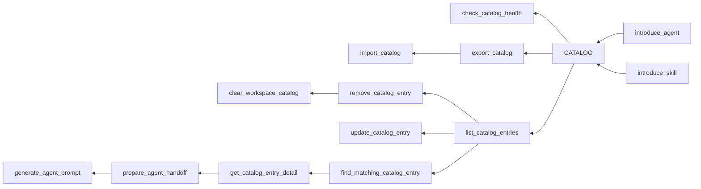

# Local Orchestration Router (LOR) MCP Server

Local Orchestration Router (LOR) is a local MCP server that acts as a catalog
for Codex agents and skills. It will let a configured workspace introduce known
agents and skills, store their routing metadata, and help a current Codex agent
find relevant catalog entries for a task.

The first implementation is a Deno TypeScript MCP server that can run as a local
Streamable HTTP server for Codex, with stdio kept as a compatibility and
development fallback. Product and technical planning remain documented under
`docs/`.

## Project Goals

- Provide a workspace-scoped catalog of introduced Codex agents and skills.
- Support task-based lookup for relevant agents and skills.
- Return structured MCP tool responses that Codex agents can consume reliably.
- Keep catalog data durable, local, and isolated by client-supplied workspace.

## Documentation

- `docs/readme.md`: planning docs overview.
- `docs/roadmap.md`: feature spec roadmap.
- `docs/feature-specs/`: feature specification drafts and template.
- `docs/use-cases/`: use case scenario drafts and template.
- `docs/tech-specs/`: technical design drafts and template.

## MCP Tool Map



## Runtime

Run the local HTTP MCP server:

```sh
deno task serve
```

To load local settings from `.env`, run:

```sh
deno task --env-file=.env serve
```

Then connect Codex to the already-running server:

```sh
codex mcp add lor-mcp --url http://127.0.0.1:8765/mcp
```

Equivalent Codex config:

```toml
[mcp_servers.lor-mcp]
url = "http://127.0.0.1:8765/mcp"
```

Server-owned storage defaults are used when no environment variables are set:

- SQLite database: `.lor-mcp/catalog.db`.

Catalog tools require a `workspace` input supplied by the client. Use the client
workspace folder name, such as `LOR-MCP`, unless the caller has a more stable
workspace slug.

Optional server-side environment overrides:

- `LOR_DB_PATH`: local SQLite database path.
- `LOR_HOST`: local HTTP host, default `127.0.0.1`.
- `LOR_PORT`: local HTTP port, default `8765`.
- `LOR_LOG_LEVEL`: log level, default `info`.
- `LOR_LOG_FORMAT`: log format, default `pretty`; set `json` for structured
  machine-readable logs.

Logs are written to stderr so the stdio MCP fallback can keep stdout reserved
for protocol messages. Useful local logging commands:

```sh
LOR_LOG_LEVEL=debug deno task serve
LOR_LOG_FORMAT=json deno task serve
deno task --env-file=.env serve
deno task serve 2>&1 | tee /tmp/lor-mcp.log
```

Run the stdio fallback:

```sh
deno task run
```

Verification:

```sh
deno task check
deno task test
deno task lint
deno task fmt
```

The configured SQLite driver uses a native library through Deno FFI and may
download/cache that library on first use.

## Repository Notes

- `AGENTS.md`: repository-specific Codex operating instructions.
- `.temp/`: local agent-supporting guidance and vendored skills used while
  developing this repository.
