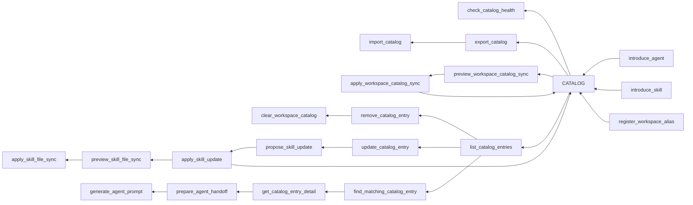

# Local Orchestration Router (LOR) MCP Server

Local Orchestration Router (LOR) is a local MCP server that acts as a catalog
for Codex agents and skills. It lets a configured workspace register known
agents and skills, store routing metadata, find relevant catalog entries for a
task, prepare agent handoff prompts, and improve registered skill context over
time.

The current implementation is a Deno TypeScript MCP server that runs as a local
Streamable HTTP server for Codex, with stdio kept as a compatibility and
development fallback. Product specs, use cases, and technical decisions remain
documented under `docs/`.

## Current Status

LOR is implemented as a runnable local v1 MCP server.

- Runtime: Deno TypeScript.
- Primary transport: local Streamable HTTP at `http://127.0.0.1:8765/mcp`.
- Fallback transport: stdio through `deno task run`.
- Storage: server-owned local SQLite database under `.lor-mcp/` by default.
- Catalog scope: caller-supplied `workspace`, resolved through canonical
  workspace paths and registered aliases.
- Matching: deterministic local fuzzy scoring with structured explanations,
  conflict reporting, and registered skill context signals.
- Skill improvement: approval-gated stored skill context updates, with optional
  approval-gated sync into a LOR-managed `SKILL.md` section.
- Handoff: LOR prepares dispatch-ready handoff prompts; Codex-native thread
  tools remain responsible for sending work to registered Codex sessions.

## Project Goals

- Provide a workspace-scoped catalog of introduced Codex agents and skills.
- Support task-based lookup for relevant agents and skills.
- Return structured MCP tool responses that Codex agents can consume reliably.
- Keep catalog data durable, local, and isolated by client-supplied workspace.
- Keep local skill-file writes explicit, previewed, and limited to managed
  sections.

## Documentation

- `docs/readme.md`: planning docs overview.
- `docs/roadmap.md`: feature spec roadmap.
- `docs/feature-specs/`: feature specification drafts and template.
- `docs/use-cases/`: use case scenario drafts and template.
- `docs/tech-specs/`: technical specs, with completed specs under `done/`,
  future specs under `future/`, and `template.md` for new specs.

## MCP Tool Map



## Daily Usage

Use LOR in two loops: routing and catalog improvement.

Before starting meaningful work, ask the active Codex agent to route through
LOR:

```text
Before starting, use LOR MCP with workspace `<workspace>` to find relevant
agents or skills for this task. Fetch details for promising results. If another
agent is a better fit, prepare a handoff prompt and send it through the
registered Codex session when reachable.
```

Common routing flow:

1. `find_matching_catalog_entry`
2. `get_catalog_entry_detail`
3. `prepare_agent_handoff` when another registered agent should receive work
4. Codex-native thread communication using the registered `codexSessionId`

Common catalog improvement flow:

1. `propose_skill_update` to preview better stored skill context.
2. `apply_skill_update` with `confirm: true` after review.
3. `preview_skill_file_sync` when the approved context should be written into
   the local skill file.
4. `apply_skill_file_sync` with `confirm: true` after reviewing the rendered
   managed section.

Catalog maintenance tools:

- `list_catalog_entries`
- `check_catalog_health`
- `update_catalog_entry`
- `remove_catalog_entry`
- `clear_workspace_catalog`
- `export_catalog`
- `import_catalog`
- `preview_workspace_catalog_sync`
- `apply_workspace_catalog_sync`

## Runtime

Run the local HTTP MCP server:

```sh
deno task serve
```

To load local settings from `.env`, run:

```sh
deno task --env-file=.env serve
```

Then connect Codex to the already-running server:

```sh
codex mcp add lor-mcp --url http://127.0.0.1:8765/mcp
```

Equivalent Codex config:

```toml
[mcp_servers.lor-mcp]
url = "http://127.0.0.1:8765/mcp"
```

Server-owned storage defaults are used when no environment variables are set:

- SQLite database: `.lor-mcp/catalog.db`.
- Skill roots: `.temp/skills`, `~/.codex/skills`, and `~/.agents/skills`.

Catalog tools require a `workspace` input supplied by the client. LOR normalizes
path-shaped workspace values and resolves registered aliases before reading or
writing catalog rows. For example, `/Users/me/project`, `/Users/me/project/`,
and a registered `project` alias can point at the same canonical workspace. Use
`register_workspace_alias` when a folder name or older slug should resolve to a
canonical workspace path.

Optional server-side environment overrides:

- `LOR_DB_PATH`: local SQLite database path.
- `LOR_SKILL_ROOTS`: comma-separated local skill roots for approved `SKILL.md`
  sync. LOR resolves `skillName/SKILL.md` under these roots and does not accept
  arbitrary skill file paths through MCP tool input.
- `LOR_HOST`: local HTTP host, default `127.0.0.1`.
- `LOR_PORT`: local HTTP port, default `8765`.
- `LOR_LOG_LEVEL`: log level, default `info`.
- `LOR_LOG_FORMAT`: log format, default `pretty`; set `json` for structured
  machine-readable logs.

Logs are written to stderr so the stdio MCP fallback can keep stdout reserved
for protocol messages. Useful local logging commands:

```sh
LOR_LOG_LEVEL=debug deno task serve
LOR_LOG_FORMAT=json deno task serve
deno task --env-file=.env serve
deno task serve 2>&1 | tee /tmp/lor-mcp.log
```

Run the stdio fallback:

```sh
deno task run
```

Verification:

```sh
deno task check
deno task test
deno task lint
deno task fmt
```

The configured SQLite driver uses a native library through Deno FFI and may
download/cache that library on first use.

## Repository Notes

- `AGENTS.md`: repository-specific Codex operating instructions.
- `.temp/`: local agent-supporting guidance and vendored skills used while
  developing this repository.
