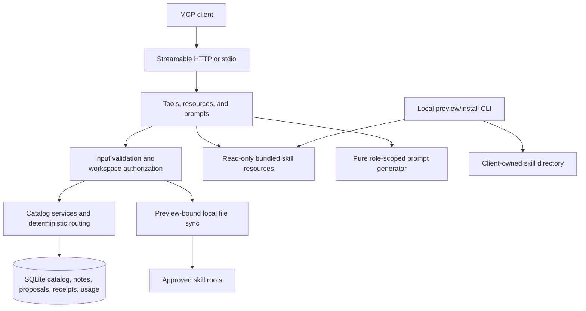

# Local Orchestration Router (LOR)

LOR is a local MCP server for reusable skills, subagent prompt profiles, and
workspace notes. It stores catalog metadata in SQLite, matches tasks to relevant
context, and generates role-scoped prompts for a client to use.

**LOR prepares context; it does not execute agents.** A subagent profile is
stored guidance, not a running process. LOR does not create chats, send agent
messages, or schedule delegated work. The connected host owns those actions.

## Compatibility and Trust

| Component      | Current contract                                                                   |
| -------------- | ---------------------------------------------------------------------------------- |
| Application    | `3.0.0`, tracked in `VERSION` and `src/version.ts`                                 |
| Storage        | SQLite schema `14`, migrated during database initialization                        |
| MCP            | Locked TypeScript SDK 1.x; automated compatibility tests use protocol `2025-06-18` |
| Transports     | Session-based Streamable HTTP; stdio fallback                                      |
| Bundled skills | Independently versioned in `skills/manifest.json`                                  |

The application version is not a protocol version. LOR does not claim the draft
Skills Extension or newer protocol compatibility. Source version `3.0.0` also
does not prove an already-running server has been restarted with that code.

The supported deployment is **local, trusted, and single-operator**. HTTP binds
to loopback and rejects non-local hosts and cross-origin browser requests. Other
local processes can still reach the port: these checks are not caller
authentication. Do not expose LOR through a tunnel or reverse proxy as a remote
multi-user service.

## Architecture


```mermaid
flowchart TD
  Client["MCP client"] --> Transport["Streamable HTTP or stdio"]
  Transport --> Interface["Tools, resources, and prompts"]
  Interface --> Policy["Input validation and workspace authorization"]
  Policy --> Catalog["Catalog services and deterministic routing"]
  Catalog --> DB[("SQLite catalog, notes, proposals, receipts, usage")]
  Policy --> Sync["Preview-bound local file sync"]
  Sync --> Files["Approved skill roots"]
  Interface --> Bundled["Read-only bundled skill resources"]
  Interface --> Prompts["Pure role-scoped prompt generator"]
  Installer["Local preview/install CLI"] --> Bundled
  Installer --> Destination["Client-owned skill directory"]
```

Catalog operations resolve the supplied workspace and registered aliases before
checking host-owned access policy. Workspace and global entries are separate
scopes; a path, alias, or resource URI is not an access grant. Notes are always
workspace-scoped and are not candidates for skill/subagent matching.

Routing is deterministic local scoring, not an LLM call. It normalizes task
signals and aliases, filters stop words, applies required signals and
exclusions, then ranks candidates using structured metadata and weighted fields.
Implementation guidance is loaded with details, not used as ranking text.

List and match operations return summaries. Clients fetch full instructions only
for relevant entries. Bundled defaults and pure prompt generation do not require
a populated catalog or open the registry database. Loading context never grants
permission to override user instructions.

## Quick Start

### Prerequisites

- Deno 2 with the task flags used in [deno.json](deno.json).
- An MCP client supporting Streamable HTTP or stdio.
- A writable, operator-controlled storage directory.
- Permission to load the SQLite driver's native library through Deno FFI.
  Initial dependency/library resolution may require network access; use the
  committed lockfile and do not bypass integrity checks.

### Start and Connect

Run from the LOR checkout. Replace `/absolute/path/to/project` with an existing
project's canonical path:

```sh
LOR_ALLOWED_WORKSPACES=/absolute/path/to/project deno task serve
```

The endpoint is `http://127.0.0.1:8765/mcp`. The database defaults to
`.lor-mcp/catalog.db` inside the server working directory, **not** the
authorized project. Global reads are enabled; global writes, alias management,
and local file sync remain disabled.

Connect Codex to the already-running HTTP server:

```sh
codex mcp add lor-mcp --url http://127.0.0.1:8765/mcp
```

Alternatively, configure the host's MCP server URL. For Codex:

```toml
[mcp_servers.lor-mcp]
url = "http://127.0.0.1:8765/mcp"
```

For stdio, have the host launch `deno task run` from the LOR checkout with
`LOR_ALLOWED_WORKSPACES` set. To run it manually from that same directory:

```sh
LOR_ALLOWED_WORKSPACES=/absolute/path/to/project deno task run
```

Stdout is reserved for MCP messages; application logs go to stderr. For either
transport, local dotenv settings can be loaded explicitly, for example
`deno task --env-file=.env serve`. Keep environment files out of source control.
See [Deno task documentation](https://docs.deno.com/runtime/reference/cli/task/)
for task environment loading.

### Verify the Connection

1. Initialize the client and discover `tools/list`.
2. Call `get_workspace_diagnostics` with the authorized `workspace`. Check its
   resolved workspace, release version, build ID, and tool-contract fingerprint.
3. Call `list_skills` with that workspace and `scope: "workspace"`. An empty
   catalog is valid; an access denial means policy/configuration needs
   attention.
4. Call `list_default_skills`, then `get_default_skill` for `lor-find-context`.
   These bundled reads are independent of registered catalog entries.

Reconnect and refresh host discovery after an upgrade. A server cannot force the
host to replace cached model-visible tool definitions.

## Configuration

These values are read by the server. Boolean flags accept `true` or `false`.
Defaults assume the process starts in the LOR checkout.

| Variable                     | Default                                                     | Purpose and implications                                                                                       |
| ---------------------------- | ----------------------------------------------------------- | -------------------------------------------------------------------------------------------------------------- |
| `LOR_ALLOWED_WORKSPACES`     | Server working directory                                    | Comma-separated canonical workspace identifiers; request arguments cannot expand this list.                    |
| `LOR_GLOBAL_READ`            | `true`                                                      | Allows global and combined-scope reads; explicit workspace-only reads do not need it.                          |
| `LOR_GLOBAL_WRITE`           | `false`                                                     | Allows authorized global catalog mutations; enable only for trusted publishers.                                |
| `LOR_ALLOW_LOCAL_FILES`      | `false`                                                     | Enables managed server-side skill file sync.                                                                   |
| `LOR_ALLOW_ALIAS_MANAGEMENT` | `false`                                                     | Enables alias changes; alias and target identifiers must both be authorized.                                   |
| `LOR_DB_PATH`                | `<cwd>/.lor-mcp/catalog.db`                                 | Server-owned SQLite path; protect the database and backups as private context.                                 |
| `LOR_SKILL_ROOTS`            | `<cwd>/.temp/skills`, `~/.codex/skills`, `~/.agents/skills` | Comma-separated roots for managed file sync, not arbitrary client-selected paths. Home roots depend on `HOME`. |
| `LOR_HOST`                   | `127.0.0.1`                                                 | HTTP only; configuration accepts loopback values `127.0.0.1`, `localhost`, or `::1`.                           |
| `LOR_PORT`                   | `8765`                                                      | HTTP only; integer from 1 through 65535.                                                                       |
| `LOR_LOG_LEVEL`              | `info`                                                      | `trace`, `debug`, `info`, `warn`, `error`, `fatal`, or `silent`.                                               |
| `LOR_LOG_FORMAT`             | `pretty`                                                    | Use `json` for structured stderr logs.                                                                         |

Application policy and Deno permissions are separate layers. The tasks declare
environment, filesystem, FFI, system, and network permissions. Setting an env
variable does not expand those grants. In particular, the shipped HTTP task
grants binding on `127.0.0.1`; an alternative loopback host may need matching
runtime permissions.

New skill/subagent registrations default to **global** scope. With the default
write policy, send `scope: "workspace"` explicitly. Do not enable global writes
just to register project-local context.

## MCP Interface and Workflows

Use `tools/list` for authoritative input/output schemas and annotations. The
following table groups representative tools rather than duplicating every
schema. Unknown fields and malformed nested values are rejected.

| Area                    | Representative tools                                                                                                             |
| ----------------------- | -------------------------------------------------------------------------------------------------------------------------------- |
| Routing                 | `find_matching_skill`, `find_matching_subagent`                                                                                  |
| Catalog reads           | `list_skills`, `list_subagents`, `get_skill_detail`, `get_subagent_detail`                                                       |
| Catalog writes          | `introduce_skill`, `introduce_subagent`, `update_skill`, `update_subagent`, `remove_skill`, `remove_subagent`                    |
| Skill improvement       | `propose_skill_update`, `apply_skill_update`                                                                                     |
| File and workspace sync | `preview_skill_file_sync`, `apply_skill_file_sync`, `preview_workspace_catalog_sync`, `apply_workspace_catalog_sync`             |
| Notes                   | `remember_workspace_note`, `list_workspace_notes`, `find_matching_workspace_note`, `get_workspace_note`, `remove_workspace_note` |
| Maintenance             | `export_catalog`, `import_catalog`, `register_workspace_alias`                                                                   |
| Diagnostics             | `get_workspace_diagnostics`, `check_catalog_health`, `get_usage_analytics`, `get_operation`                                      |
| Bundled context         | `list_default_skills`, `get_default_skill`, `generate_agent_prompt`                                                              |
| Large results           | `read_result_page`                                                                                                               |

### Route and Load Context

Normalize the user's intent into a concise task plus meaningful routing fields.
Do not copy incidental words into keyword lists. These are tool arguments for
`find_matching_skill`, not an HTTP request body:

```json
{
  "workspace": "/absolute/path/to/project",
  "task": "Evaluate received pull request feedback against current code",
  "intent": "received-pr-feedback-triage",
  "positiveKeywords": ["review-comment", "feedback-validity"],
  "domain": ["code-review"],
  "outputNeed": ["issue", "impact", "importance", "ease-of-fix"],
  "debug": true
}
```

A matching skill must exist in the catalog; this example does not promise a
particular result. Inspect explanations or `no_match`, then load only relevant
details. `requiredAll` and `requiredAny` are eligibility constraints, not score
boosts. `outputNeed` alone cannot establish relevance. Use the separate note
matcher for durable workspace knowledge.

### Register and Update Explicitly

`introduce_skill` registers metadata for an existing skill; it does not create
or install the local skill package. After checking for duplicates, example
arguments for a workspace registration are:

```json
{
  "workspace": "/absolute/path/to/project",
  "scope": "workspace",
  "skillName": "api-contract-review",
  "projectName": "example-project",
  "displayName": "API Contract Review",
  "primarySpecialty": "Review API compatibility",
  "specialtyTags": ["api", "compatibility"]
}
```

Before `update_skill`, read `get_skill_detail` for the same workspace, scope,
and skill name. Substitute its returned `revision` for the illustrative
64-character digest below; the all-zero digest is not a usable revision.

```json
{
  "workspace": "/absolute/path/to/project",
  "scope": "workspace",
  "skillName": "api-contract-review",
  "expectedRevision": "0000000000000000000000000000000000000000000000000000000000000000",
  "displayName": "API Compatibility Review"
}
```

Skill/subagent update and remove tools require `expectedRevision`. On
`revision_conflict`, reread and reconcile. Omitted update fields stay unchanged;
arrays and routing objects replace existing values. Only nullable fields accept
`null` to clear them. Do not assume note removal or bulk clear uses this same
revision contract; inspect its specific schema.

For context improvements, propose and review before `apply_skill_update`.
Proposals bind content, source revision, workspace, and expiry. File and
workspace sync have separate preview/apply flows: pass the reviewed
`previewDigest` and `confirm: true`. Changed inputs or targets require a fresh
preview.

### Pagination, Results, and Recovery

Lists/exports default to 20 entries, with a maximum of 100. Follow `nextCursor`
using identical filters and limit. Catalog/note mutations invalidate cursors;
usage counters do not. On `invalid_cursor`, restart the listing. Each export
page is independently importable, but one page is not a full export or database
backup.

Tool execution results contain `structuredContent` and a compatibility text
copy. Interpret `status` (`ok`, `no_match`, `conflict`, `error`, or `deferred`)
rather than treating every returned MCP result as success. Execution failures
include `isError: true` and actionable error information; malformed protocol or
schema requests can fail before tool execution.

Serialized tool results are capped at 256 KiB, including the compatibility copy.
For `status: "deferred"`, follow `data.resultResource.uri` with `resources/read`
or call `read_result_page` using its snapshot ID and offset. Follow each
`nextUri`, concatenate the page `text` values in order, and parse the original
JSON only after the last page. Offsets are UTF-16 character positions, not
bytes.

Result snapshots expire after five minutes, capacity eviction, or restart. Their
16 MiB retention budget includes original inputs and is shared across HTTP
sessions. Pages reauthorize the original private operation and never repeat it.
A `response_too_large` error or expired result does not prove a write failed.

For writes supporting `idempotencyKey`, use one key per logical operation. After
an uncertain outcome, inspect the target and `get_operation` (using that key as
`operationKey`). Replay a completed operation only with the identical request
and key. A pending receipt requires reconciliation, not a new retry key: receipt
reservation, mutation, and completion are not one atomic transaction.
Multi-entry imports/syncs can also partially succeed.

### Resources and Prompts

Discover static resources with `resources/list` and templates with
`resources/templates/list`. Use returned URIs rather than constructing them.

| Resource                                              | Meaning                                                                     |
| ----------------------------------------------------- | --------------------------------------------------------------------------- |
| `lor://skills/index.json`                             | Bundled skill names, versions, aliases, and URIs                            |
| `lor://skills/{name}/{version}/SKILL.md`              | Bundled instructions; sibling `manifest.json` describes files and checksums |
| `lor://catalog/{kind}/{scope}/{workspace}/{entryKey}` | Authorized skill, subagent, or note detail from list-summary `resourceUri`  |
| `lor://results/{snapshotId}/{offset}`                 | Short-lived result page                                                     |

Catalog workspace/key components are percent-encoded once. Global resources
still carry the caller's authorized workspace. Notes require workspace scope.
Resources are context, not higher-priority instructions.

The native `lor-agent-prompt` prompt uses the same generator as
`generate_agent_prompt`; neither starts an agent. Clients lacking resources or
prompts can use the corresponding detail, bundled-skill, and prompt tools.

## Bundled Skills

| Skill              | Version | Purpose                                                 |
| ------------------ | ------- | ------------------------------------------------------- |
| `lor-manage-skill` | `1.1.0` | Registration, updates, scope, routing, and verification |
| `lor-find-context` | `1.0.0` | Find and load skills, profiles, and notes               |
| `lor-manage-note`  | `1.0.0` | Maintain requested durable workspace notes              |

Aliases such as `lor-add-skill` and `lor-add-note` are discovery names, not new
MCP tools. Bundled packages do not seed or overwrite registry entries; listing
registered skills will not automatically list bundled defaults.

Install on the client machine, from the checkout, into an existing absolute,
non-symlink directory. Review the preview, then replace `<preview-plan-hash>`:

```sh
deno task skills preview --root "$HOME/.codex/skills" --skill lor-manage-skill
deno task skills install --root "$HOME/.codex/skills" --skill lor-manage-skill --plan <preview-plan-hash>
```

The installer validates paths, checksums, package limits, and current local
content. Modified/unmanaged folders, symlinks, and downgrades conflict; there is
no force-overwrite mode. Installation never executes bundled scripts. Checksums
detect inconsistent content, not publisher authenticity. Reload the host as
needed; installation does not edit its settings.

For remote package retrieval, the [CLI usage](src/skills/cli.ts) documents
paired `--server` and `--version` flags; explicit network permission is
required. See the
[recovery runbook](docs/runbooks/mcp-hardening.md#filesystem-recovery) for
interrupted installs and managed file sync.

## Development and Operations

### Source Map and Checks

| Path                                  | Responsibility                                                    |
| ------------------------------------- | ----------------------------------------------------------------- |
| `src/server.ts`, `src/http_server.ts` | MCP registration and HTTP sessions                                |
| `src/tools/`                          | Schemas, tool handlers, authorization, receipts, response budgets |
| `src/catalog/`                        | Routing, catalog services, revisions, SQLite persistence          |
| `src/skills/`, `skills/`              | Bundled resources, installers, managed sync, package content      |
| `src/agent_prompts/`                  | Pure prompt generation                                            |
| `test/`                               | Unit, database, protocol, and subprocess coverage                 |

Run checks from the checkout; these commands describe the verification surface,
not a claim that any particular build or client has passed.

| Command                      | Checks                                                              |
| ---------------------------- | ------------------------------------------------------------------- |
| `deno task check`            | Type checking for source and tests                                  |
| `deno task test`             | Automated suite, including temporary SQLite fixtures                |
| `deno task lint`             | Deno lint rules                                                     |
| `deno task fmt`              | Formatting for configured source, tests, and skills                 |
| `deno fmt --check README.md` | README formatting, outside the task's path list                     |
| `deno task test:stdio`       | Real subprocess startup, restart, discovery, and retry smoke checks |

### Diagnostics and Limits

Use `LOR_LOG_FORMAT=json` for structured stderr logs. Logs report request IDs,
tool names, outcomes, and timing, not raw prompts or note bodies. Workspace
paths and entry names remain sensitive operational metadata.

Diagnostics expose `releaseVersion`, `buildId`, `buildIdSource`, and
`toolContractFingerprint`. Build identity hashes source/config at module load,
not a signed artifact; source-less packaging reports unavailable. Compare build
and contract identities after restart, then refresh client discovery.

List/export payloads are paged in SQLite, but counts/order may scan matching
keys. Matching, health, and diagnostics still perform full-catalog analysis.
HTTP session/body limits and result budgets are documented in the
[hardening runbook](docs/runbooks/mcp-hardening.md#monitoring-and-resource-limits).
They do not provide remote multi-tenant isolation.

### Upgrade to 3.0.0

Stop writers and the old server, preserve a complete SQLite backup, and test
schema 14 migration against a copy with isolated skill roots. Configure explicit
workspace policy and verify revision, preview, pagination, and deferred-result
handling before reconnecting clients. Never run old and new binaries against the
same database.

Rollback requires the pre-upgrade database and configuration together;
post-backup writes must be reconciled. Pending receipts and filesystem
interruptions need operator recovery. Automated SDK tests do not establish
desktop-client UX or power-loss safety.

Follow the [upgrade procedure](docs/runbooks/mcp-hardening.md#upgrade-procedure)
and
[client acceptance matrix](docs/runbooks/mcp-hardening.md#client-acceptance-matrix).
See [CHANGELOG.md](CHANGELOG.md) for release changes,
[versioning](docs/versioning.md) for release conventions, and the
[documentation index](docs/readme.md) for design background. Historical specs
may describe older surfaces; current registrations and schemas are
authoritative.
