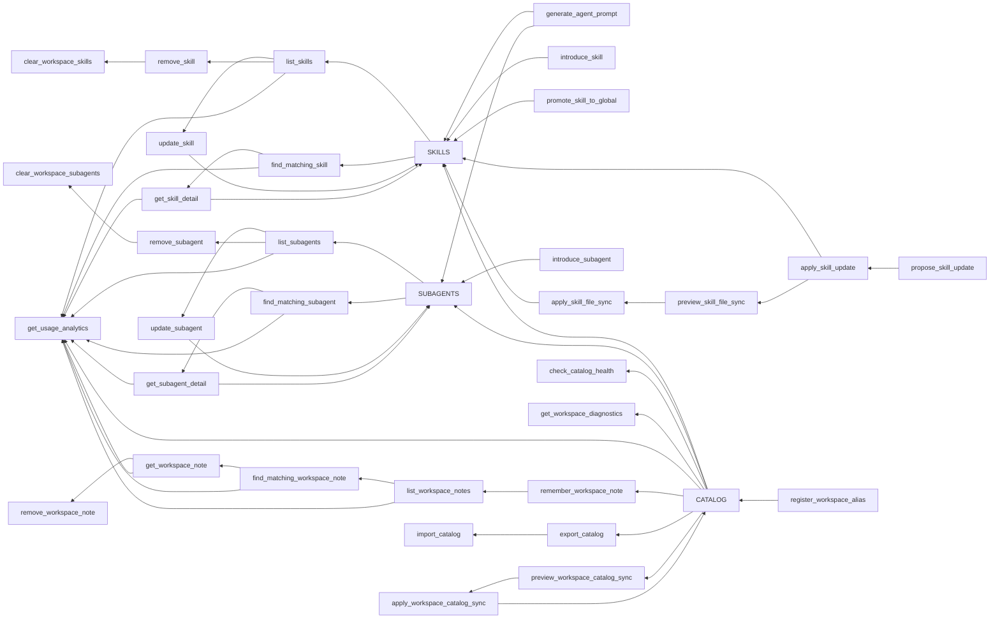

# Local Orchestration Router (LOR) MCP Server

Local Orchestration Router (LOR) is a local MCP server that acts as a catalog,
prompt, and workspace-readiness layer for Codex skills and reusable subagent
prompt profiles. It lets a configured workspace register known entries, store
routing metadata, find relevant catalog entries for a task, generate manual
Codex prompts, and improve registered skill context over time.

The current implementation is a Deno TypeScript MCP server that runs as a local
Streamable HTTP server for Codex, with stdio kept as a compatibility and
development fallback. Product specs, use cases, and technical decisions remain
documented under `docs/`.

## Current Status

LOR is implemented as a runnable local 2.0.0 MCP server.

- Runtime: Deno TypeScript.
- Primary transport: local Streamable HTTP at `http://127.0.0.1:8765/mcp`.
- Fallback transport: stdio through `deno task run`.
- Storage: server-owned local SQLite database under `.lor-mcp/` by default.
- Catalog scope: caller-supplied `workspace`, resolved through canonical
  workspace paths and registered aliases.
- Tool surface: type-specific skill and subagent tools, plus catalog
  import/export, workspace sync, diagnostics, prompt generation, and workspace
  memory. Public registered-agent catalog tools have been removed from the V2
  surface.
- Local context: diagnostics report `AGENTS.md` status and local Codex skill
  alignment without rewriting local instruction files.
- Usage analytics: local aggregate counters show which skills, subagents, and
  workspace notes are listed, matched, and opened in detail without storing raw
  prompts or note bodies.
- Structured routing metadata: skills and subagents can declare intents,
  required signals, positive and negative keywords, domains, output needs, and
  field weights for deterministic matching.
- Negative routing metadata: skills and subagents can carry structured "do not
  use when" guidance so matching can suppress or demote false positives.
- Implementation guidance: selected skills can carry detail-loaded operational
  guidance without adding large blocks to list or match responses.

## Runtime

### Bundled Default Skills

LOR ships `lor-manage-skill` version 1.1.0 as an Agent Skills package. Its
instructions cover creating, registering, and updating skills, including scope,
duplicates, routing, and read-back verification. `lor-add-skill` and
`lor-update-skill` are discovery aliases, not separate MCP tools or canonical
catalog keys.

`lor-find-context` and `lor-manage-note` (both 1.0.0) cover context retrieval
and durable workspace notes. They are generic across repositories. Clients
without resource support can use `list_default_skills` and `get_default_skill`;
these tools do not open the registry database. The latter accepts listed
aliases.

Both transports advertise read-only MCP resources:

- `lor://skills/index.json`: compact catalog with versions, aliases, and URIs.
- `lor://skills/lor-manage-skill/1.1.0/SKILL.md`: the skill entrypoint.
- `lor://skills/lor-manage-skill/1.1.0/manifest.json`: file paths, byte sizes,
  and SHA-256 checksums.
- Supporting Markdown files are separately readable at the same versioned base
  URI, for example `references/registration-and-updates.md`.

Use `resources/list` and `resources/read` through the connected client. Read the
entrypoint first and supporting files only when needed. Resource availability
does not imply every host automatically discovers or activates skills. This uses
ordinary MCP resources; it does not advertise the draft Skills Extension.
Bundled resources work without SQLite or a populated registry. They are separate
from user-managed catalog entries and do not seed or overwrite global/workspace
rows. Existing `list_skills` and matching tools continue to query registered
entries only.

The canonical source is `skills/manifest.json` and its listed skill directories.
When changing released package content, bump that skill's version in the catalog
and its `SKILL.md` metadata. Ship the `skills/` directory with `src/`; keep
files UTF-8 text. The installer validates unique relative paths, checksums, a 1
MiB per-file limit, and a 4 MiB package limit. Checksums detect inconsistent
content; they do not establish publisher trust.

### Install Into The Local Client Setup

Run the installer **on the machine where the skill should be saved**. For
example, from this checkout, using an existing local skill directory:

```sh
deno task skills list
deno task skills preview --root "$HOME/.codex/skills" --skill lor-manage-skill
deno task skills install --root "$HOME/.codex/skills" --skill lor-manage-skill --plan <hash-from-preview>
```

The root must be an existing absolute directory, not a symlink. Choose a
directory supported by your host; LOR does not edit client settings or guess an
install destination. Preview writes nothing. Apply binds the preview to the
canonical root, package content, and current installation. Read the resulting
verification and use the host's refresh/reload mechanism if required.

The installer records `.lor-install.json` inside each installed skill. An
identical install is a no-op. Newer versions replace only intact managed
folders; edits, extra files, deleted files, symlinks, invalid receipts,
same-version changes, downgrades, and unmanaged folders are conflicts. There is
no force-overwrite mode. Resolve conflicts yourself or choose another root, then
preview again. Installs use staging and an exclusive root lock, with restoration
on a failed replacement. An interrupted process may leave
`.lor-skills-install.lock` or a `.lor-skill-stage-*` directory. Confirm no
installer is running and inspect any `previous` backup before removing
leftovers. Do not edit a skill concurrently with installation. The lock
coordinates installers; it is not a security boundary against processes with
write access to the same directory. Multi-package API calls preflight all
conflicts, but commit one package at a time; rerun preview after any failure.
The CLI installs one selected skill at a time.

For a skill served by another LOR instance, fetch the exact version over MCP:

```sh
deno run --allow-read --allow-write --allow-net=127.0.0.1:8765 src/skills/cli.ts preview --root "$HOME/.codex/skills" --skill lor-manage-skill --server http://127.0.0.1:8765/mcp --version 1.1.0
```

Apply with the same arguments, replacing `preview` with `install` and adding
`--plan <hash-from-preview>`. Grant network permission only for the selected
server. Remote hosts require HTTPS. The CLI supports servers without an OAuth
flow; for authenticated connections, use the host's MCP resource access and
local file capabilities. The server never writes to the remote client's disk,
and installation never executes bundled scripts or registers catalog entries.

### Start The Server

Read the [hardening and recovery runbook](docs/runbooks/mcp-hardening.md) before
upgrading an existing installation. This branch introduces deliberate client
contract changes: workspace allowlists, restricted global writes, revision and
preview preconditions, and paginated discovery/export. The locked SDK still uses
session-based MCP; this is not a protocol-version upgrade.

Run the local HTTP MCP server:

```sh
deno task serve
```

To load local settings from `.env`, run:

```sh
deno task --env-file=.env serve
```

Then connect Codex to the already-running server:

```sh
codex mcp add lor-mcp --url http://127.0.0.1:8765/mcp
```

Equivalent Codex config:

```toml
[mcp_servers.lor-mcp]
url = "http://127.0.0.1:8765/mcp"
```

Server-owned storage defaults are used when no environment variables are set:

- SQLite database: `.lor-mcp/catalog.db`.
- Skill roots: `.temp/skills`, `~/.codex/skills`, and `~/.agents/skills`.

Catalog tools require a `workspace` input supplied by the client. LOR normalizes
path-shaped workspace values and resolves registered aliases before reading or
writing catalog rows. For example, `/Users/me/project`, `/Users/me/project/`,
and a registered `project` alias can point at the same canonical workspace. Use
`register_workspace_alias` when a folder name or older slug should resolve to a
canonical workspace path.

Optional server-side environment overrides:

- `LOR_ALLOWED_WORKSPACES`: comma-separated canonical workspace identifiers;
  defaults to the server working directory. Tool input does not grant access.
- `LOR_GLOBAL_READ`: defaults to `true`; combined workspace/global searches
  require it. Explicit workspace-only reads do not.
- `LOR_GLOBAL_WRITE`: defaults to `false`; enable only for authorized
  publishers.
- `LOR_ALLOW_LOCAL_FILES`: defaults to `false`; permits managed local file sync.
- `LOR_ALLOW_ALIAS_MANAGEMENT`: defaults to `false`; alias and destination
  identifiers must both be allowed by the trusted policy.

- `LOR_DB_PATH`: local SQLite database path.
- `LOR_SKILL_ROOTS`: comma-separated local skill roots for approved `SKILL.md`
  sync. LOR resolves `skillName/SKILL.md` under these roots and does not accept
  arbitrary skill file paths through MCP tool input.
- `LOR_HOST`: local HTTP host, default `127.0.0.1`.
- `LOR_PORT`: local HTTP port, default `8765`.
- `LOR_LOG_LEVEL`: log level, default `info`.
- `LOR_LOG_FORMAT`: log format, default `pretty`; set `json` for structured
  machine-readable logs.

Logs are written to stderr so the stdio MCP fallback can keep stdout reserved
for protocol messages. Useful local logging commands:

```sh
LOR_LOG_LEVEL=debug deno task serve
LOR_LOG_FORMAT=json deno task serve
deno task --env-file=.env serve
deno task serve 2>&1 | tee /tmp/lor-mcp.log
```

Run the stdio fallback:

```sh
deno task run
```

Verification:

```sh
deno task check
deno task test
deno task lint
deno task fmt
```

The configured SQLite driver uses a native library through Deno FFI and may
download/cache that library on first use.

## Codex Personalization Snippet

Copy this into your Codex personalization or custom instructions so LOR is used
consistently across prompts:

```text
When working in a repository, use LOR MCP before substantive planning,
implementation, or review.

Use the current repository path as the LOR workspace. Start by calling
get_workspace_diagnostics and check_catalog_health for that workspace. If the
workspace resolves unexpectedly, use the reported diagnostics to fix or explain
the workspace/alias issue before relying on catalog results.

For routing and context, prefer LOR skills and subagent profiles:
- Use find_matching_skill for relevant registered skill metadata.
- Use find_matching_subagent for reusable scoped prompt profiles.
- Use get_skill_detail or get_subagent_detail when a match needs full metadata.
- Use generate_agent_prompt only when preparing a fresh short-lived Codex chat.

LOR prepares context and prompts; it does not create Codex chats, send messages,
or control other agents. Use native Codex behavior for any chat creation or
handoff, and report clearly when LOR is unavailable or has no useful match.

Keep edits scoped to the user's request, preserve unrelated user work, prefer
existing project patterns, and report exact verification commands and results.
```

## Daily Usage

Use LOR as a local routing, prompt, and workspace-knowledge layer for Codex.
Every catalog, prompt, and memory call should include the caller's `workspace`
so LOR can resolve aliases and keep data isolated by project.

### Start A Workspace Session

Before meaningful work, ask the active Codex agent to inspect the workspace and
route through LOR:

```text
Use LOR MCP with workspace `<workspace>`.
First call get_workspace_diagnostics and check_catalog_health.
Then use find_matching_skill and find_matching_subagent for the current task.
```

Use `get_workspace_diagnostics` when a workspace path, folder-name alias, or
older slug may be resolving to the wrong catalog, or when you need to compare
local Codex skills with LOR-registered skill metadata. Use
`check_catalog_health` to inspect stored verification metadata and
skill/subagent coverage.

### Route Work

Use routing when deciding what context should shape a task:

1. `find_matching_skill` for relevant stored skill metadata.
2. `find_matching_subagent` for scoped reusable prompt profiles.
3. `get_skill_detail` or `get_subagent_detail` when the match result needs full
   metadata.
4. `generate_agent_prompt` when a fresh short-lived Codex task prompt is useful.

Use `list_skills` and `list_subagents` when browsing by entry family.
`get_skill_detail` returns full implementation guidance when a selected skill
has it. `get_subagent_detail` returns the rendered prompt for a subagent
profile.

When a task has a clear intent, pass structured match fields such as `intent`,
`positiveKeywords`, `negativeKeywords`, `requiredAny`, `requiredAll`, `domain`,
or `outputNeed`. Use `debug: true` when investigating routing quality; LOR will
return normalized query signals, ignored stop words, excluded candidates, and a
weighted score breakdown.

### Improve Skills

1. `propose_skill_update` to preview better stored skill context.
2. `apply_skill_update` with `confirm: true` after review.
3. `preview_skill_file_sync` when the approved context should be written into
   the local skill file.
4. `apply_skill_file_sync` with `confirm: true` and the preview's
   `previewDigest` after reviewing the rendered managed section. The source
   proposal must belong to the same workspace. Local edits invalidate the
   preview.

Use `promote_skill_to_global` when a workspace skill should become available to
other workspaces. New skill registrations default to global scope unless
`scope: "workspace"` is supplied. Global skills are included in list and match
by default.

### Remember Workspace Context

Use workspace memory for small coordination notes that are not routing metadata:

1. `remember_workspace_note` for branch plans, review summaries, migration
   notes, or reapply instructions.
2. `list_workspace_notes` to scan note summaries, optionally by tag.
3. `find_matching_workspace_note` to retrieve ranked note previews for the
   current task or question.
4. `get_workspace_note` to retrieve the full note body.
5. `remove_workspace_note` when the note is obsolete.

Workspace notes are not catalog entries and are not used by skill/subagent
matching. Use `find_matching_workspace_note` when you want note-specific memory
retrieval.

### Inspect Usage

Use `get_usage_analytics` to see which skills, subagents, and workspace notes
are actually being listed, matched, or opened in detail. Filter by `entryType`,
`scope`, `entryKey`, or `projectName` when reviewing a specific family or entry.

### Maintain The Catalog

Use maintenance and expansion tools when the workspace catalog needs cleanup,
backup, or migration:

- `list_skills`, `list_subagents`
- `update_skill`, `update_subagent`
- `remove_skill`, `remove_subagent`
- `clear_workspace_skills`, `clear_workspace_subagents`
- `export_catalog`
- `import_catalog`
- `preview_workspace_catalog_sync`
- `apply_workspace_catalog_sync`
- `introduce_subagent`
- `get_usage_analytics`

## MCP Tool Map


```mermaid
flowchart RL
  catalog["CATALOG"]
  skills["SKILLS"]
  subagents["SUBAGENTS"]

  catalog --> skills
  catalog --> subagents

  generatePrompt["generate_agent_prompt"] --> skills
  generatePrompt --> subagents

  introduceSkill["introduce_skill"] --> skills
  promoteSkill["promote_skill_to_global"] --> skills
  proposeSkillUpdate["propose_skill_update"] --> applySkillUpdate["apply_skill_update"]
  applySkillUpdate --> skills
  applySkillUpdate --> previewSkillFileSync["preview_skill_file_sync"]
  previewSkillFileSync --> applySkillFileSync["apply_skill_file_sync"]
  applySkillFileSync --> skills

  introduceSubagent["introduce_subagent"] --> subagents

  registerAlias["register_workspace_alias"] --> catalog
  catalog --> checkHealth["check_catalog_health"]
  catalog --> workspaceDiagnostics["get_workspace_diagnostics"]
  catalog --> usageAnalytics["get_usage_analytics"]
  catalog --> rememberWorkspaceNote["remember_workspace_note"]
  rememberWorkspaceNote --> listWorkspaceNotes["list_workspace_notes"]
  listWorkspaceNotes --> findWorkspaceNote["find_matching_workspace_note"]
  findWorkspaceNote --> getWorkspaceNote["get_workspace_note"]
  getWorkspaceNote --> removeWorkspaceNote["remove_workspace_note"]
  catalog --> exportCatalog["export_catalog"]
  exportCatalog --> importCatalog["import_catalog"]
  catalog --> previewWorkspaceSync["preview_workspace_catalog_sync"]
  previewWorkspaceSync --> applyWorkspaceSync["apply_workspace_catalog_sync"]
  applyWorkspaceSync --> catalog
  skills --> listSkills["list_skills"]
  subagents --> listSubagents["list_subagents"]

  listSkills --> updateSkill["update_skill"]
  updateSkill --> skills
  listSubagents --> updateSubagent["update_subagent"]
  updateSubagent --> subagents
  listSkills --> removeSkill["remove_skill"]
  listSubagents --> removeSubagent["remove_subagent"]
  removeSkill --> clearSkills["clear_workspace_skills"]
  removeSubagent --> clearSubagents["clear_workspace_subagents"]
  skills --> findSkill["find_matching_skill"]
  subagents --> findSubagent["find_matching_subagent"]
  findSkill --> getSkill["get_skill_detail"]
  findSubagent --> getSubagent["get_subagent_detail"]
  getSkill --> skills
  getSubagent --> subagents
  listSkills --> usageAnalytics
  listSubagents --> usageAnalytics
  findSkill --> usageAnalytics
  findSubagent --> usageAnalytics
  getSkill --> usageAnalytics
  getSubagent --> usageAnalytics
  listWorkspaceNotes --> usageAnalytics
  findWorkspaceNote --> usageAnalytics
  getWorkspaceNote --> usageAnalytics
```

## Capability Details

### Runtime And Storage

- Version: `2.0.0`.
- Runtime: Deno TypeScript.
- Primary transport: local Streamable HTTP at `http://127.0.0.1:8765/mcp`.
- Fallback transport: stdio through `deno task run`.
- Storage: server-owned local SQLite database under `.lor-mcp/` by default.
- Catalog scope: caller-supplied `workspace`, resolved through canonical
  workspace paths and registered aliases.

### Catalog And Routing

- Matching: deterministic local scoring with structured routing metadata,
  normalized aliases, stop-word filtering, hard exclusions before ranking,
  structured explanations, conflict reporting, and registered skill context
  signals.
- Global skills: shared skills can be introduced or promoted with
  `scope: "global"` and are included in list/match by default. New skill
  registrations default to global scope unless `scope: "workspace"` is supplied.
- Subagents: reusable prompt profiles for small, scoped delegation, with
  workspace/global scope and ready-to-use prompts returned from introduction and
  detail flows. Matching returns summaries. New registrations default to global
  scope unless `scope: "workspace"` is supplied.
- Negative routing: skills and subagents can store structured exclusion
  metadata. Strong negative matches are suppressed, moderate negative matches
  are demoted, and visible demotions include negative evidence in explanations.
- Debug routing: `debug: true` on matching calls returns normalized query
  signals, ignored signals, excluded candidates, weighted match signals, and
  final score breakdowns for routing-quality work.
- Implementation guidance: skills can store detail-loaded first-inspect lists,
  implementation rules, common fix patterns, test expectations, verification,
  and handoff checklists. Matching does not score this guidance.

### Prompt Support

- Agent prompts: `generate_agent_prompt` creates deterministic ready-to-paste
  prompts for fresh Codex chats without registering or messaging agents.

### Skill And Workspace Knowledge

- Skill improvement: approval-gated stored skill context updates, with optional
  approval-gated sync into a LOR-managed `SKILL.md` section.
- Workspace memory: LOR stores small workspace-scoped notes for durable
  coordination context outside the routing catalog. Notes are always
  workspace-scoped and do not accept global scope.

### Operational Support

- Workspace diagnostics: LOR can report resolved workspace aliases, catalog
  counts, and sanitized storage/runtime status without exposing catalog entries.
- HTTP discovery logging: expected OAuth/OIDC `.well-known` discovery probe
  `404` responses stay below warning severity while real unrelated `4xx`
  responses remain warnings.

## Repository Notes

- `CHANGELOG.md`: version history.
- `VERSION`: current project version.
- `docs/readme.md`: planning docs overview.
- `docs/roadmap.md`: feature spec roadmap and implementation status.
- `AGENTS.md`: repository-specific Codex operating instructions.
- `.temp/`: local agent-supporting guidance and vendored skills used while
  developing this repository.
