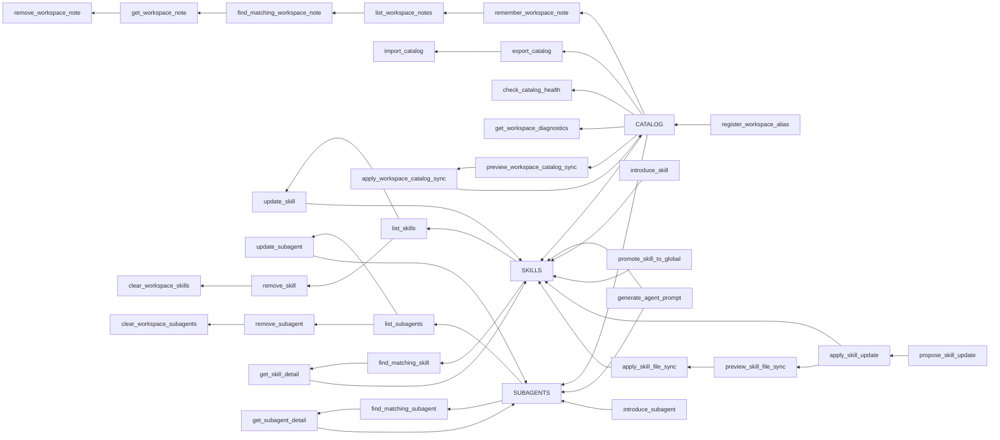

# Local Orchestration Router (LOR) MCP Server

Local Orchestration Router (LOR) is a local MCP server that acts as a catalog,
prompt, and workspace-readiness layer for Codex skills and reusable subagent
prompt profiles. It lets a configured workspace register known entries, store
routing metadata, find relevant catalog entries for a task, generate manual
Codex prompts, and improve registered skill context over time.

The current implementation is a Deno TypeScript MCP server that runs as a local
Streamable HTTP server for Codex, with stdio kept as a compatibility and
development fallback. Product specs, use cases, and technical decisions remain
documented under `docs/`.

## Current Status

LOR is implemented as a runnable local 2.0.0 MCP server.

- Runtime: Deno TypeScript.
- Primary transport: local Streamable HTTP at `http://127.0.0.1:8765/mcp`.
- Fallback transport: stdio through `deno task run`.
- Storage: server-owned local SQLite database under `.lor-mcp/` by default.
- Catalog scope: caller-supplied `workspace`, resolved through canonical
  workspace paths and registered aliases.
- Tool surface: type-specific skill and subagent tools, plus catalog
  import/export, workspace sync, diagnostics, prompt generation, and workspace
  memory. Public registered-agent catalog tools have been removed from the V2
  surface.
- Local context: diagnostics report `AGENTS.md` status and local Codex skill
  alignment without rewriting local instruction files.

## Runtime

Run the local HTTP MCP server:

```sh
deno task serve
```

To load local settings from `.env`, run:

```sh
deno task --env-file=.env serve
```

Then connect Codex to the already-running server:

```sh
codex mcp add lor-mcp --url http://127.0.0.1:8765/mcp
```

Equivalent Codex config:

```toml
[mcp_servers.lor-mcp]
url = "http://127.0.0.1:8765/mcp"
```

Server-owned storage defaults are used when no environment variables are set:

- SQLite database: `.lor-mcp/catalog.db`.
- Skill roots: `.temp/skills`, `~/.codex/skills`, and `~/.agents/skills`.

Catalog tools require a `workspace` input supplied by the client. LOR normalizes
path-shaped workspace values and resolves registered aliases before reading or
writing catalog rows. For example, `/Users/me/project`, `/Users/me/project/`,
and a registered `project` alias can point at the same canonical workspace. Use
`register_workspace_alias` when a folder name or older slug should resolve to a
canonical workspace path.

Optional server-side environment overrides:

- `LOR_DB_PATH`: local SQLite database path.
- `LOR_SKILL_ROOTS`: comma-separated local skill roots for approved `SKILL.md`
  sync. LOR resolves `skillName/SKILL.md` under these roots and does not accept
  arbitrary skill file paths through MCP tool input.
- `LOR_HOST`: local HTTP host, default `127.0.0.1`.
- `LOR_PORT`: local HTTP port, default `8765`.
- `LOR_LOG_LEVEL`: log level, default `info`.
- `LOR_LOG_FORMAT`: log format, default `pretty`; set `json` for structured
  machine-readable logs.

Logs are written to stderr so the stdio MCP fallback can keep stdout reserved
for protocol messages. Useful local logging commands:

```sh
LOR_LOG_LEVEL=debug deno task serve
LOR_LOG_FORMAT=json deno task serve
deno task --env-file=.env serve
deno task serve 2>&1 | tee /tmp/lor-mcp.log
```

Run the stdio fallback:

```sh
deno task run
```

Verification:

```sh
deno task check
deno task test
deno task lint
deno task fmt
```

The configured SQLite driver uses a native library through Deno FFI and may
download/cache that library on first use.

## Codex Personalization Snippet

Copy this into your Codex personalization or custom instructions so LOR is used
consistently across prompts:

```text
When working in a repository, use LOR MCP before substantive planning,
implementation, or review.

Use the current repository path as the LOR workspace. Start by calling
get_workspace_diagnostics and check_catalog_health for that workspace. If the
workspace resolves unexpectedly, use the reported diagnostics to fix or explain
the workspace/alias issue before relying on catalog results.

For routing and context, prefer LOR skills and subagent profiles:
- Use find_matching_skill for relevant registered skill metadata.
- Use find_matching_subagent for reusable scoped prompt profiles.
- Use get_skill_detail or get_subagent_detail when a match needs full metadata.
- Use generate_agent_prompt only when preparing a fresh short-lived Codex chat.

LOR prepares context and prompts; it does not create Codex chats, send messages,
or control other agents. Use native Codex behavior for any chat creation or
handoff, and report clearly when LOR is unavailable or has no useful match.

Keep edits scoped to the user's request, preserve unrelated user work, prefer
existing project patterns, and report exact verification commands and results.
```

## Daily Usage

Use LOR as a local routing, prompt, and workspace-knowledge layer for Codex.
Every catalog, prompt, and memory call should include the caller's `workspace`
so LOR can resolve aliases and keep data isolated by project.

### Start A Workspace Session

Before meaningful work, ask the active Codex agent to inspect the workspace and
route through LOR:

```text
Use LOR MCP with workspace `<workspace>`.
First call get_workspace_diagnostics and check_catalog_health.
Then use find_matching_skill and find_matching_subagent for the current task.
```

Use `get_workspace_diagnostics` when a workspace path, folder-name alias, or
older slug may be resolving to the wrong catalog, or when you need to compare
local Codex skills with LOR-registered skill metadata. Use
`check_catalog_health` to inspect stored verification metadata and
skill/subagent coverage.

### Route Work

Use routing when deciding what context should shape a task:

1. `find_matching_skill` for relevant stored skill metadata.
2. `find_matching_subagent` for scoped reusable prompt profiles.
3. `get_skill_detail` or `get_subagent_detail` when the match result needs full
   metadata.
4. `generate_agent_prompt` when a fresh short-lived Codex task prompt is useful.

Use `list_skills` and `list_subagents` when browsing by entry family.
`get_subagent_detail` returns the rendered prompt for a subagent profile.

### Improve Skills

1. `propose_skill_update` to preview better stored skill context.
2. `apply_skill_update` with `confirm: true` after review.
3. `preview_skill_file_sync` when the approved context should be written into
   the local skill file.
4. `apply_skill_file_sync` with `confirm: true` after reviewing the rendered
   managed section.

Use `promote_skill_to_global` when a workspace skill should become available to
other workspaces. Global skills are included in list and match by default.

### Remember Workspace Context

Use workspace memory for small coordination notes that are not routing metadata:

1. `remember_workspace_note` for branch plans, review summaries, migration
   notes, or reapply instructions.
2. `list_workspace_notes` to scan note summaries, optionally by tag.
3. `find_matching_workspace_note` to retrieve ranked note previews for the
   current task or question.
4. `get_workspace_note` to retrieve the full note body.
5. `remove_workspace_note` when the note is obsolete.

Workspace notes are not catalog entries and are not used by skill/subagent
matching. Use `find_matching_workspace_note` when you want note-specific memory
retrieval.

### Maintain The Catalog

Use maintenance and expansion tools when the workspace catalog needs cleanup,
backup, or migration:

- `list_skills`, `list_subagents`
- `update_skill`, `update_subagent`
- `remove_skill`, `remove_subagent`
- `clear_workspace_skills`, `clear_workspace_subagents`
- `export_catalog`
- `import_catalog`
- `preview_workspace_catalog_sync`
- `apply_workspace_catalog_sync`
- `introduce_subagent`

## MCP Tool Map


```mermaid
flowchart RL
  catalog["CATALOG"]
  skills["SKILLS"]
  subagents["SUBAGENTS"]

  catalog --> skills
  catalog --> subagents

  generatePrompt["generate_agent_prompt"] --> skills
  generatePrompt --> subagents

  introduceSkill["introduce_skill"] --> skills
  promoteSkill["promote_skill_to_global"] --> skills
  proposeSkillUpdate["propose_skill_update"] --> applySkillUpdate["apply_skill_update"]
  applySkillUpdate --> skills
  applySkillUpdate --> previewSkillFileSync["preview_skill_file_sync"]
  previewSkillFileSync --> applySkillFileSync["apply_skill_file_sync"]
  applySkillFileSync --> skills

  introduceSubagent["introduce_subagent"] --> subagents

  registerAlias["register_workspace_alias"] --> catalog
  catalog --> checkHealth["check_catalog_health"]
  catalog --> workspaceDiagnostics["get_workspace_diagnostics"]
  catalog --> rememberWorkspaceNote["remember_workspace_note"]
  rememberWorkspaceNote --> listWorkspaceNotes["list_workspace_notes"]
  listWorkspaceNotes --> findWorkspaceNote["find_matching_workspace_note"]
  findWorkspaceNote --> getWorkspaceNote["get_workspace_note"]
  getWorkspaceNote --> removeWorkspaceNote["remove_workspace_note"]
  catalog --> exportCatalog["export_catalog"]
  exportCatalog --> importCatalog["import_catalog"]
  catalog --> previewWorkspaceSync["preview_workspace_catalog_sync"]
  previewWorkspaceSync --> applyWorkspaceSync["apply_workspace_catalog_sync"]
  applyWorkspaceSync --> catalog
  skills --> listSkills["list_skills"]
  subagents --> listSubagents["list_subagents"]

  listSkills --> updateSkill["update_skill"]
  updateSkill --> skills
  listSubagents --> updateSubagent["update_subagent"]
  updateSubagent --> subagents
  listSkills --> removeSkill["remove_skill"]
  listSubagents --> removeSubagent["remove_subagent"]
  removeSkill --> clearSkills["clear_workspace_skills"]
  removeSubagent --> clearSubagents["clear_workspace_subagents"]
  skills --> findSkill["find_matching_skill"]
  subagents --> findSubagent["find_matching_subagent"]
  findSkill --> getSkill["get_skill_detail"]
  findSubagent --> getSubagent["get_subagent_detail"]
  getSkill --> skills
  getSubagent --> subagents
```

## Capability Details

### Runtime And Storage

- Version: `2.0.0`.
- Runtime: Deno TypeScript.
- Primary transport: local Streamable HTTP at `http://127.0.0.1:8765/mcp`.
- Fallback transport: stdio through `deno task run`.
- Storage: server-owned local SQLite database under `.lor-mcp/` by default.
- Catalog scope: caller-supplied `workspace`, resolved through canonical
  workspace paths and registered aliases.

### Catalog And Routing

- Matching: deterministic local fuzzy scoring with structured explanations,
  conflict reporting, and registered skill context signals.
- Global skills: shared skills can be introduced or promoted with
  `scope: "global"` and are included in list/match by default.
- Subagents: reusable prompt profiles for small, scoped delegation, with
  workspace/global scope and ready-to-use prompts returned from introduction,
  matching, and detail flows.

### Prompt Support

- Agent prompts: `generate_agent_prompt` creates deterministic ready-to-paste
  prompts for fresh Codex chats without registering or messaging agents.

### Skill And Workspace Knowledge

- Skill improvement: approval-gated stored skill context updates, with optional
  approval-gated sync into a LOR-managed `SKILL.md` section.
- Workspace memory: LOR stores small workspace-scoped notes for durable
  coordination context outside the routing catalog.

### Operational Support

- Workspace diagnostics: LOR can report resolved workspace aliases, catalog
  counts, and sanitized storage/runtime status without exposing catalog entries.
- HTTP discovery logging: expected OAuth/OIDC `.well-known` discovery probe
  `404` responses stay below warning severity while real unrelated `4xx`
  responses remain warnings.

## Repository Notes

- `CHANGELOG.md`: version history.
- `VERSION`: current project version.
- `docs/readme.md`: planning docs overview.
- `docs/roadmap.md`: feature spec roadmap and implementation status.
- `AGENTS.md`: repository-specific Codex operating instructions.
- `.temp/`: local agent-supporting guidance and vendored skills used while
  developing this repository.
