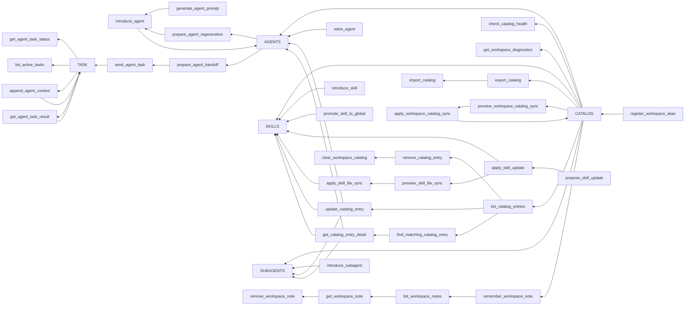

# Local Orchestration Router (LOR) MCP Server

Local Orchestration Router (LOR) is a local MCP server that acts as a catalog
and task manager for Codex agents, skills, and reusable subagent prompt
profiles. It lets a configured workspace register known entries, store routing
metadata, find relevant catalog entries for a task, prepare agent handoff
prompts, manage delegated agent tasks, and improve registered skill context over
time.

The current implementation is a Deno TypeScript MCP server that runs as a local
Streamable HTTP server for Codex, with stdio kept as a compatibility and
development fallback. Product specs, use cases, and technical decisions remain
documented under `docs/`.

## Runtime

Run the local HTTP MCP server:

```sh
deno task serve
```

To load local settings from `.env`, run:

```sh
deno task --env-file=.env serve
```

Then connect Codex to the already-running server:

```sh
codex mcp add lor-mcp --url http://127.0.0.1:8765/mcp
```

Equivalent Codex config:

```toml
[mcp_servers.lor-mcp]
url = "http://127.0.0.1:8765/mcp"
```

Server-owned storage defaults are used when no environment variables are set:

- SQLite database: `.lor-mcp/catalog.db`.
- Skill roots: `.temp/skills`, `~/.codex/skills`, and `~/.agents/skills`.

Catalog tools require a `workspace` input supplied by the client. LOR normalizes
path-shaped workspace values and resolves registered aliases before reading or
writing catalog rows. For example, `/Users/me/project`, `/Users/me/project/`,
and a registered `project` alias can point at the same canonical workspace. Use
`register_workspace_alias` when a folder name or older slug should resolve to a
canonical workspace path.

Optional server-side environment overrides:

- `LOR_DB_PATH`: local SQLite database path.
- `LOR_SKILL_ROOTS`: comma-separated local skill roots for approved `SKILL.md`
  sync. LOR resolves `skillName/SKILL.md` under these roots and does not accept
  arbitrary skill file paths through MCP tool input.
- `LOR_HOST`: local HTTP host, default `127.0.0.1`.
- `LOR_PORT`: local HTTP port, default `8765`.
- `LOR_LOG_LEVEL`: log level, default `info`.
- `LOR_LOG_FORMAT`: log format, default `pretty`; set `json` for structured
  machine-readable logs.

Logs are written to stderr so the stdio MCP fallback can keep stdout reserved
for protocol messages. Useful local logging commands:

```sh
LOR_LOG_LEVEL=debug deno task serve
LOR_LOG_FORMAT=json deno task serve
deno task --env-file=.env serve
deno task serve 2>&1 | tee /tmp/lor-mcp.log
```

Run the stdio fallback:

```sh
deno task run
```

Verification:

```sh
deno task check
deno task test
deno task lint
deno task fmt
```

The configured SQLite driver uses a native library through Deno FFI and may
download/cache that library on first use.

## Daily Usage

Use LOR as a local routing, task-management, and workspace-knowledge layer for
Codex. Every catalog, task, and memory call should include the caller's
`workspace` so LOR can resolve aliases and keep data isolated by project.

### Start A Workspace Session

Before meaningful work, ask the active Codex agent to inspect the workspace and
route through LOR:

```text
Use LOR MCP with workspace `<workspace>`.
First call get_workspace_diagnostics and check_catalog_health.
Then find matching agents, skills, or subagent profiles for this task.
```

Use `get_workspace_diagnostics` when a workspace path, folder-name alias, or
older slug may be resolving to the wrong catalog. Use `check_catalog_health` to
inspect stored verification metadata for registered agents and skills.

### Route Work

Use routing when deciding who or what should handle a task:

1. `find_matching_catalog_entry`
2. `get_catalog_entry_detail`
3. `prepare_agent_handoff` when a registered agent should receive work
4. Codex-native thread communication using the registered `codexSessionId`, or
   `send_agent_task` when using LOR's delegated task lifecycle

Reachability metadata makes agent results clearer by showing whether a
recommended registered agent is only a catalog entry, unknown, reachable, or
known unreachable.

Subagent profiles are included in `list_catalog_entries` and
`find_matching_catalog_entry` by default. `get_catalog_entry_detail` returns
their rendered prompts.

### Manage Delegated Tasks

Use delegated task tools when the work should be tracked as a task record rather
than only a one-off handoff prompt:

1. `send_agent_task` to create and dispatch or queue the task.
2. `get_agent_task_status` to inspect one task.
3. `list_active_tasks` to see open delegated work for a workspace or agent.
4. `append_agent_context` to add follow-up context while the task is open.
5. `get_agent_task_result` to retrieve a recorded result, or status-only data
   until a result exists.

The local runtime queues manual delivery instructions when no Codex-native
dispatcher is injected.

### Refresh Or Replace Agents

1. `get_catalog_entry_detail` for the context-heavy registered agent.
2. `prepare_agent_regeneration` to render a ready-to-paste replacement prompt.
3. Start a new Codex chat manually and register its new session ID with
   `introduce_agent`, optionally using `replacesAgentEntryKey`.
4. After confirming the replacement works, call `retire_agent` with
   `confirm: true` for the old agent. Retired agents remain inspectable, but
   matching and handoff avoid them.

### Improve Skills

1. `propose_skill_update` to preview better stored skill context.
2. `apply_skill_update` with `confirm: true` after review.
3. `preview_skill_file_sync` when the approved context should be written into
   the local skill file.
4. `apply_skill_file_sync` with `confirm: true` after reviewing the rendered
   managed section.

Use `promote_skill_to_global` when a workspace skill should become available to
other workspaces. Global skills are included in list and match by default.

### Remember Workspace Context

Use workspace memory for small coordination notes that are not routing metadata
and are not tied to one delegated task:

1. `remember_workspace_note` for branch plans, review summaries, migration
   notes, or reapply instructions.
2. `list_workspace_notes` to scan note summaries, optionally by tag.
3. `get_workspace_note` to retrieve the full note body.
4. `remove_workspace_note` when the note is obsolete.

Workspace notes are not catalog entries and are not used by matching in the
current version.

### Maintain The Catalog

Use maintenance and expansion tools when the workspace catalog needs cleanup,
backup, or migration:

- `list_catalog_entries`
- `update_catalog_entry`
- `retire_agent`
- `remove_catalog_entry`
- `clear_workspace_catalog`
- `export_catalog`
- `import_catalog`
- `preview_workspace_catalog_sync`
- `apply_workspace_catalog_sync`
- `introduce_subagent`

## MCP Tool Map


```mermaid
flowchart RL
  catalog["CATALOG"]
  agents["AGENTS"]
  skills["SKILLS"]
  subagents["SUBAGENTS"]
  task["TASK"]

  catalog --> agents
  catalog --> skills
  catalog --> subagents

  generatePrompt["generate_agent_prompt"] --> introduceAgent["introduce_agent"]
  introduceAgent --> agents
  agents --> handoff["prepare_agent_handoff"]
  agents --> regeneration["prepare_agent_regeneration"]
  handoff --> sendAgentTask["send_agent_task"]
  regeneration --> introduceAgent
  retireAgent["retire_agent"] --> agents

  introduceSkill["introduce_skill"] --> skills
  promoteSkill["promote_skill_to_global"] --> skills
  proposeSkillUpdate["propose_skill_update"] --> applySkillUpdate["apply_skill_update"]
  applySkillUpdate --> skills
  applySkillUpdate --> previewSkillFileSync["preview_skill_file_sync"]
  previewSkillFileSync --> applySkillFileSync["apply_skill_file_sync"]
  applySkillFileSync --> skills

  introduceSubagent["introduce_subagent"] --> subagents

  registerAlias["register_workspace_alias"] --> catalog
  catalog --> checkHealth["check_catalog_health"]
  catalog --> workspaceDiagnostics["get_workspace_diagnostics"]
  catalog --> rememberWorkspaceNote["remember_workspace_note"]
  rememberWorkspaceNote --> listWorkspaceNotes["list_workspace_notes"]
  listWorkspaceNotes --> getWorkspaceNote["get_workspace_note"]
  getWorkspaceNote --> removeWorkspaceNote["remove_workspace_note"]
  catalog --> exportCatalog["export_catalog"]
  exportCatalog --> importCatalog["import_catalog"]
  catalog --> previewWorkspaceSync["preview_workspace_catalog_sync"]
  previewWorkspaceSync --> applyWorkspaceSync["apply_workspace_catalog_sync"]
  applyWorkspaceSync --> catalog
  catalog --> listEntries["list_catalog_entries"]

  listEntries --> removeEntry["remove_catalog_entry"]
  removeEntry --> clearCatalog["clear_workspace_catalog"]
  listEntries --> updateEntry["update_catalog_entry"]
  updateEntry --> agents
  updateEntry --> skills
  updateEntry --> subagents
  listEntries --> findMatch["find_matching_catalog_entry"]
  findMatch --> detail["get_catalog_entry_detail"]
  detail --> agents
  detail --> skills
  detail --> subagents

  sendAgentTask --> task
  task --> getAgentTaskStatus["get_agent_task_status"]
  task --> listActiveTasks["list_active_tasks"]
  task --> appendAgentContext["append_agent_context"]
  task --> getAgentTaskResult["get_agent_task_result"]
  appendAgentContext --> task
  getAgentTaskResult --> task
```

## Current Status

LOR is implemented as a runnable local 2.0.0 MCP server.

### Runtime And Storage

- Version: `2.0.0`.
- Runtime: Deno TypeScript.
- Primary transport: local Streamable HTTP at `http://127.0.0.1:8765/mcp`.
- Fallback transport: stdio through `deno task run`.
- Storage: server-owned local SQLite database under `.lor-mcp/` by default.
- Catalog scope: caller-supplied `workspace`, resolved through canonical
  workspace paths and registered aliases.

### Catalog And Routing

- Matching: deterministic local fuzzy scoring with structured explanations,
  conflict reporting, and registered skill context signals.
- Global skills: shared skills can be introduced or promoted with
  `scope: "global"` and are included in list/match by default, while agents
  remain workspace-scoped.
- Subagents: reusable prompt profiles for small, scoped delegation, with
  workspace/global scope and ready-to-use prompts returned from introduction,
  matching, and detail flows.

### Agent Orchestration

- Handoff: LOR prepares dispatch-ready handoff prompts; Codex-native thread
  tools remain responsible for sending work to registered Codex sessions.
- Reachability model: LOR distinguishes catalog-only agents from agents known
  reachable through Codex-native dispatch outcomes before adding direct
  delegated task tools.
- Delegated task lifecycle: LOR can create workspace-scoped delegated task
  records, send through an injected Codex-native dispatcher when available, or
  queue tasks with manual delivery instructions in the local runtime.
- Follow-up and result retrieval: LOR stores task-scoped follow-up messages and
  returns status-only results until a delegated task result is recorded.

### Skill And Workspace Knowledge

- Skill improvement: approval-gated stored skill context updates, with optional
  approval-gated sync into a LOR-managed `SKILL.md` section.
- Workspace memory: LOR stores small workspace-scoped notes for durable
  coordination context outside the routing catalog.

### Operational Support

- Workspace diagnostics: LOR can report resolved workspace aliases, catalog
  counts, and sanitized storage/runtime status without exposing catalog entries.
- HTTP discovery logging: expected OAuth/OIDC `.well-known` discovery probe
  `404` responses stay below warning severity while real unrelated `4xx`
  responses remain warnings.

## Repository Notes

- `AGENTS.md`: repository-specific Codex operating instructions.
- `.temp/`: local agent-supporting guidance and vendored skills used while
  developing this repository.
